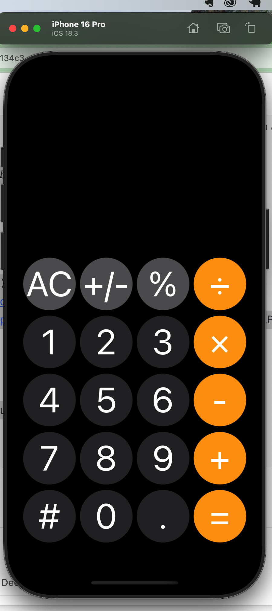
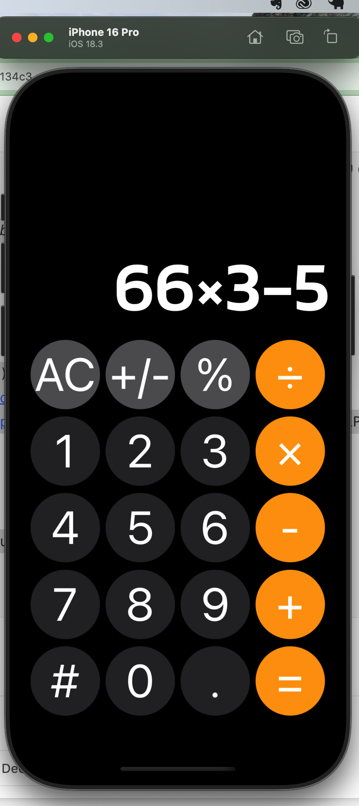
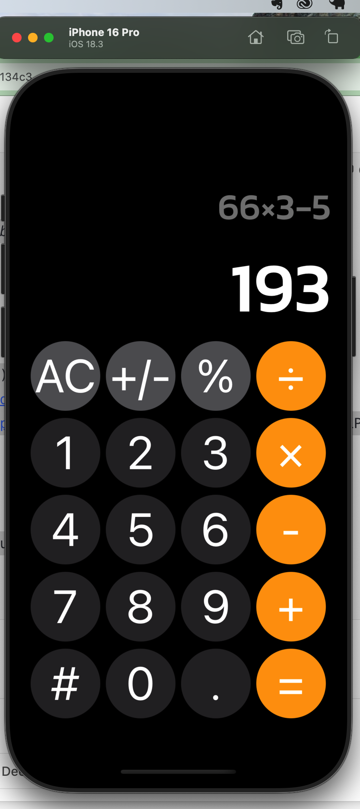
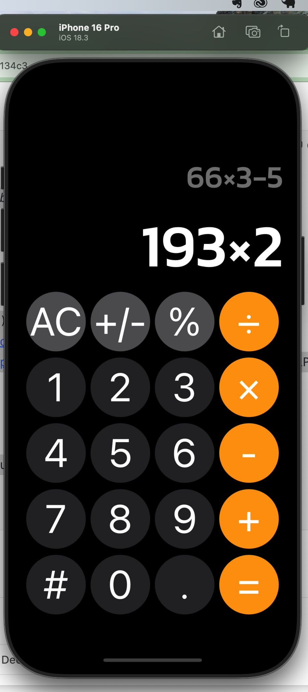
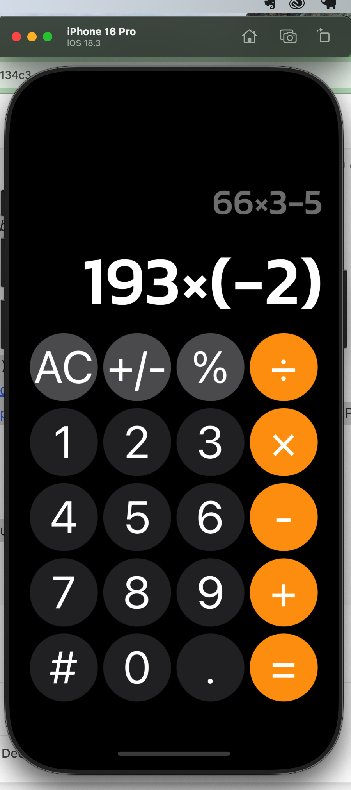
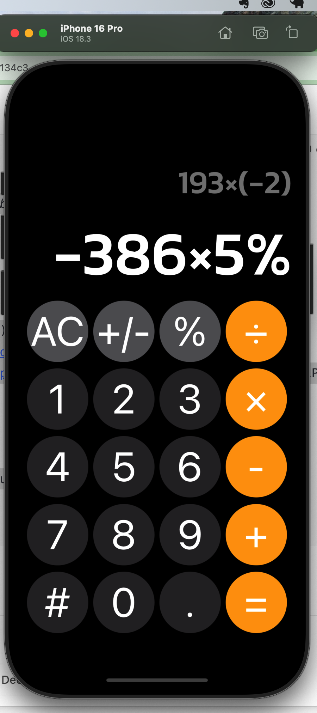
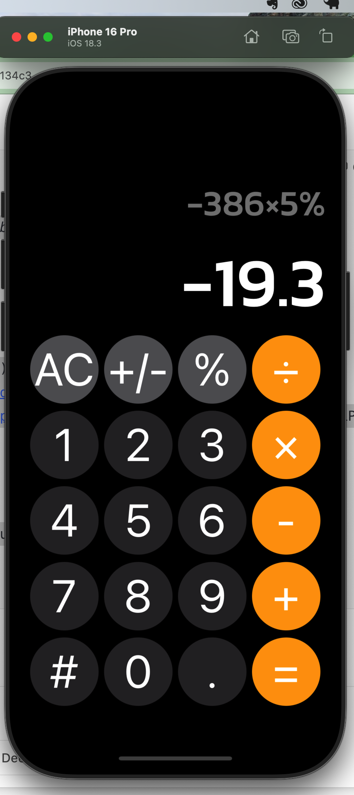

# 📱 Calculator App

A simple and functional calculator built with **React Native** and **Expo** for iOS devices.

## ✨ Features

- Basic arithmetic operations: addition, subtraction, multiplication, division
- Responsive and intuitive UI
- Designed for iPhone (Expo-based testing)
- Easy to extend with additional functionality

## 📸 Screenshots









## 🚀 Getting Started

### Prerequisites

- [Node.js](https://nodejs.org/)
- [Expo CLI](https://docs.expo.dev/get-started/installation/)
- [Expo Go App](https://apps.apple.com/app/expo-go/id982107779) on your iPhone

### Installation

```bash
git clone https://github.com/your-username/calculator-app.git
cd calculator-app
npm install


Running the App

Start the development server:

bash
Copy
Edit
npx expo start
Scan the QR code with the Expo Go app on your iPhone to launch the app.


🛠 Built With
React Native
Expo

🧑‍💻 Author

Your Hanna Zhamoida
GitHub: @kozadireza


```
